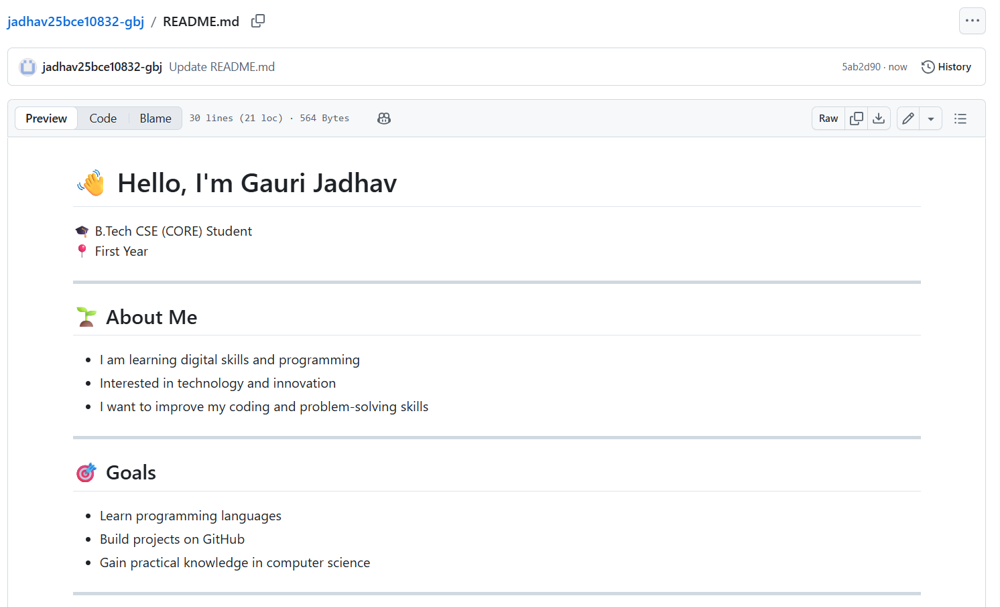
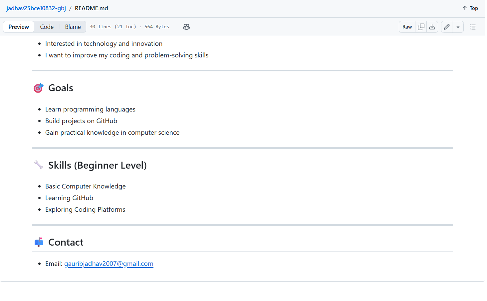
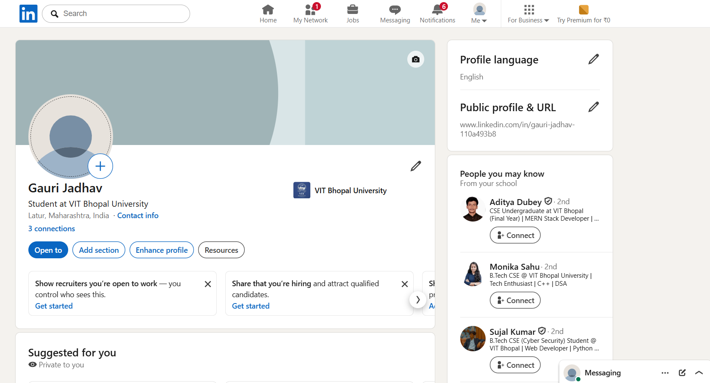
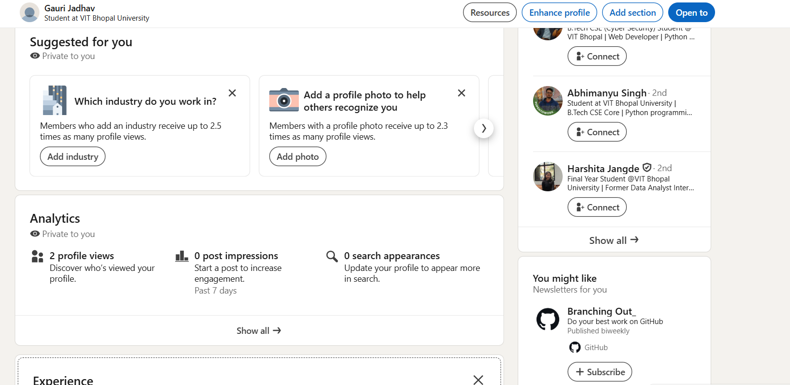
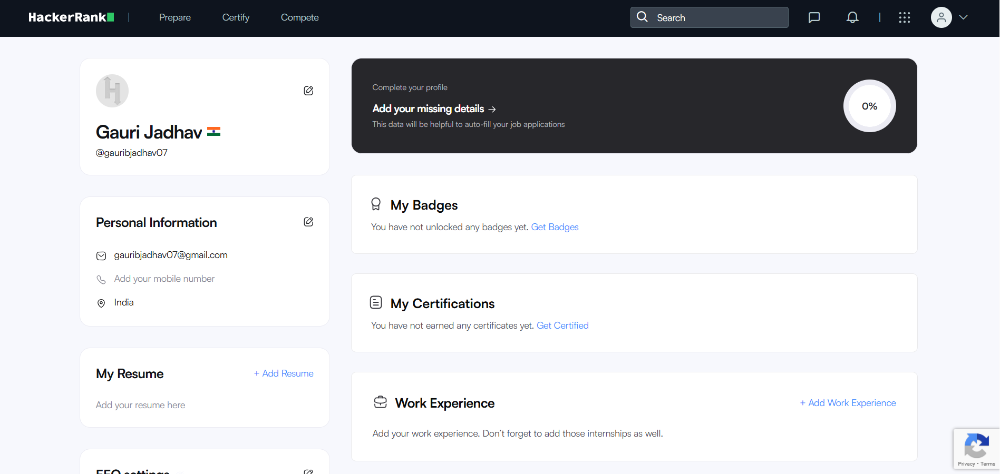
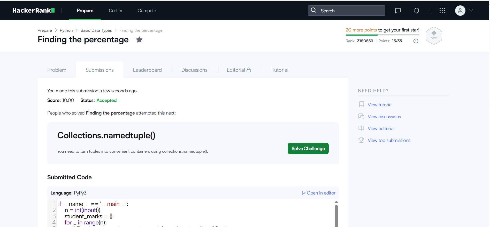
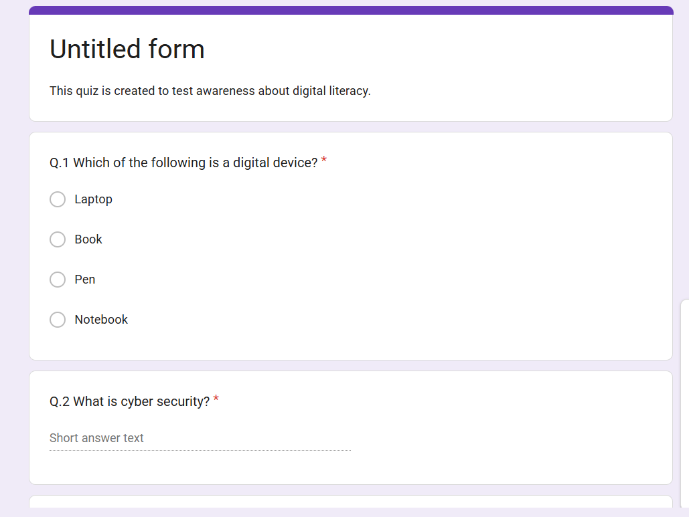
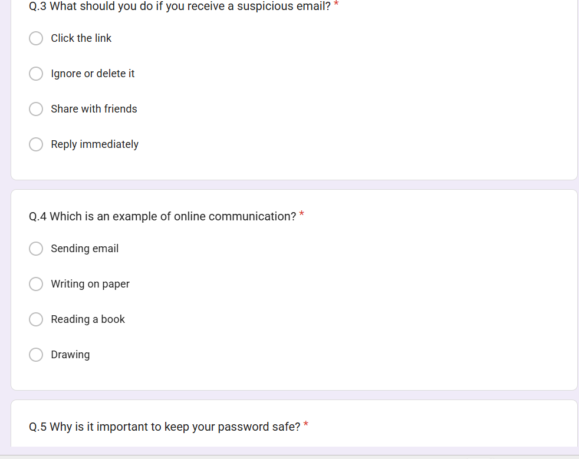
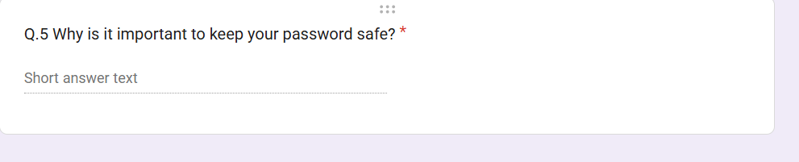
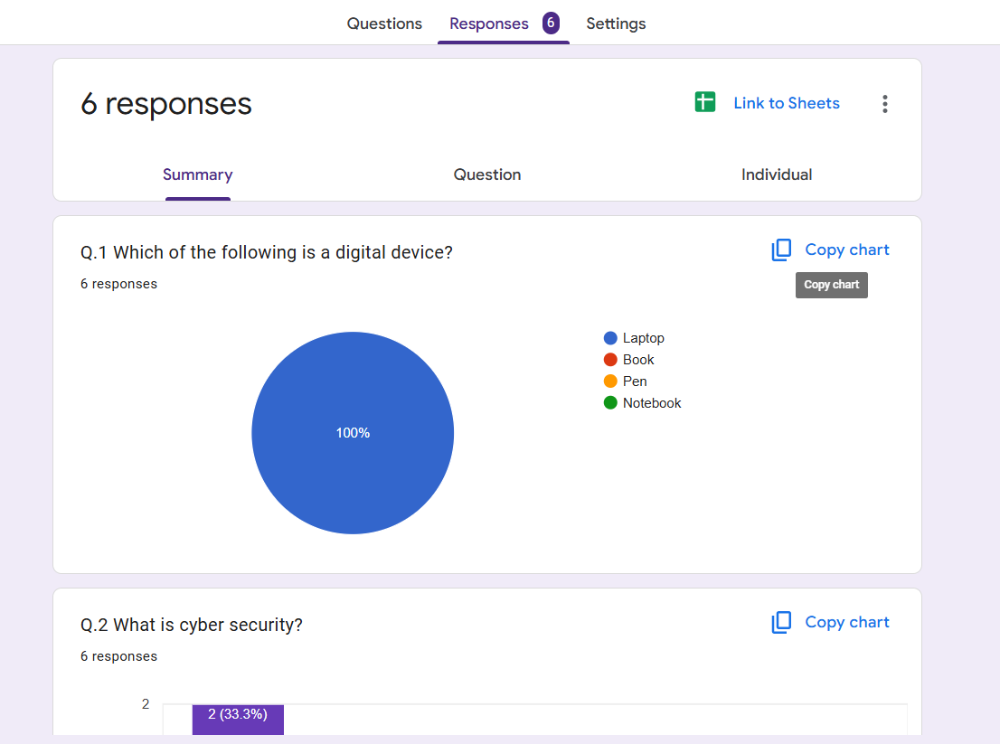

# 📘 Digital Literacy Project

## 👤 Student Details
- *Name:* Gauri Jadhav  
- *Registration Number:* 25BCE10832  
- *Branch:* CSE (CORE)  
- *Year:* 1st Year  

---

## 📚 Course Details
- *Course Code:* CSE0001  
- *Course Title:* Digital Literacy  

---

## 📌 Project Overview
This project is created as part of the Digital Literacy course.  
The main objective of this project is to develop awareness about digital tools, online safety, professional communication, and cyber security.

As a *Student Digital Ambassador*, this project demonstrates how students can effectively use digital platforms for learning, communication, and career growth.

---

##  Project Tasks

### 🔹 Task 1: Digital Literacy Infographic
   - Created an infographic using Canva

     ---

### 🔹 Task 2: Student Digital Portfolio
Build Your Student Digital Protfolio
#### GitHub Profile

#### LinkedIn Profile

#### HackerRank Profile

  

---

### 🔹 Task 3: Coding & Collaboration Platforms

📸 Screenshot of beginner-level problem solved on HackerRank  

#### HackerRank Solution

- Created a *Digital Literacy Awareness Quiz* using Google Forms
- #### Google Form (Digital Literacy Awareness Quiz)

🔗 *Google Form Link:* https://docs.google.com/forms/d/e/1FAIpQLScDXVf3yNg2wUqyHdSgeMl4gwuWZeDc1WhqKIXyLPQfQdcl6Q/viewform?usp=publish-editor

#### Responses

---  

### 🔹 Task 4: Email Etiquette
- Drafted two professional emails:
  - Assignment extension request  
  - Internship application  
- Created a Social Media Do’s & Don’ts checklist

📂 Files are available in the folder:
task-4-email-etiquette/emails.txt
task-4-email-etiquette/social-media-checklist.txt

---

 ### 🔹 Task 5: Cybercrime Awareness

- Created a case study on phishing attack explaining how the fraud happens and its impact  
- Prepared a "Stay Safe Online" checklist with prevention tips for students  

#### Case Study
[View Case Study](task-5-cybercrime/casestudy.txt)

#### Prevention Checklist
[View Checklist](task-5-cybercrime/prevention-checklist.txt)

---

