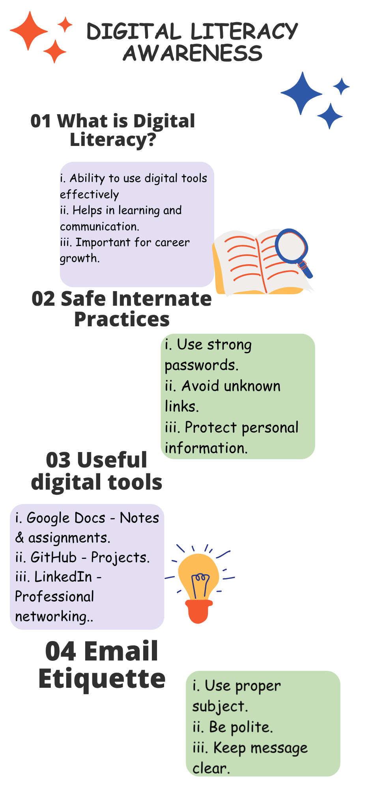

# 📘 Digital Literacy Project

## 👤 Student Details
- *Name:* Gauri Jadhav  
- *Registration Number:* 25BCE10832  
- *Branch:* CSE (CORE)  
- *Year:* 1st Year  

---

## 📚 Course Details
- *Course Code:* CSE0001  
- *Course Title:* Digital Literacy  

---

## 📌 Project Overview
This project is created as part of the Digital Literacy course.  
The main objective of this project is to develop awareness about digital tools, online safety, professional communication, and cyber security.

As a *Student Digital Ambassador*, this project demonstrates how students can effectively use digital platforms for learning, communication, and career growth.

---

##  Project Tasks

### 🔹 Task 1: Digital Literacy Infographic
   - Created an infographic using Canva

     ---

### 🔹 Task 2: Student Digital Portfolio
Build Your Student Digital Protfolio
task-2-portfolio/
   github-profile-1.png
   github-profile-2.png
   hackerrank-profile.png
   linkedin-profile-1.png
   linkedin-profile-2.png
  

---

  

